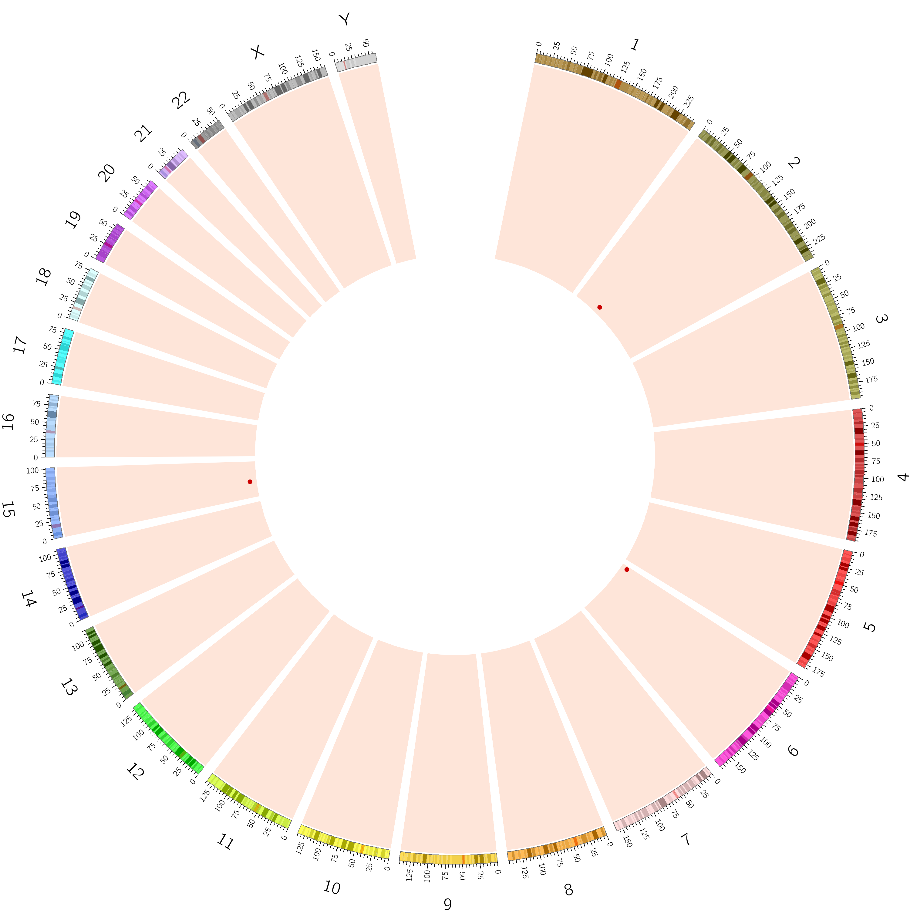

# iGWOS
**i**ntegrated **G**enome-**W**ide **O**ff-target cleavage **S**earch platform

## Introduction
iGWOS is designed specifically for an integrate analysis of the high-throughput sequencing data generated from various mainstream CRISPR/SpCas9 off-target detection techniques, as well as for optimal off-target sites (OTS) prediction by integrating the available OTS prediction tools in a complementary way.   
* Current data processing supports three OTS detection techniques (GUIDE-seq, CIRCLE-seq, and SITE-seq).  
* Current integrate method iGWOS, by integrating OTS prediction tools with an Adaboost framework, supports conventional NGG-PAM OTS prediction with mismatches up to 5, both for in vitro CIRCLE-seq, and cell-based experimental OTS detection in human species.

# Integrate NGS data processing on CRISPR OTS detection techniques
iGWOS integrated a CIRCLE-seq analytic software of 0.1.0 version on GitHub at [https://github.com/tsailabSJ/circleseq](https://github.com/tsailabSJ/circleseq), as well as a GUIDE-seq analysis pipeline of 0.9.0 version on GitHub at [https://github.com/aryeelab/guideseq](https://github.com/aryeelab/guideseq), which were both developed by Shengdar Q Tsai, Martin Aryee, and Ved V Topkar.

By inputting sequencing data generated from a certain technique, iGWOS returns the detected off-target sites on reference genome and visualizes the genome-wide off-target profile with a Circos plot.
## Requirement

* HTSeq == 0.6.1    
* PyYAML == 3.11    
* swalign == 0.3.1  
* pyfaidx == 0.2.7  
* svgwrite == 1.1.6     
* regex == 2016.07.21   
* numpy == 1.11.1   
* nwalign == 0.3.1  
* statsmodels == 0.6.1  
* pysam == 0.9.1.4 

## Usage
	python [option0] {GUIDE-seq,CIRCLE-seq,SITE-seq} [option1]
	
#### option0:    
    -h --help :
        show the help message
    -UID:
        user id, necessary if -U is True, for the determination of data source
    -D:
        description of sgRNA
    -U:
        if you are willing to upload part of your data and share them to all the researchers of CRIPSR
    -O:
        output folder
    -L:
        the name of CRISPR/Cas which you use in the experiment
    -r1:
        treated sequencing data 1, it need to be noticed that different methods require different types of input data
    -r2:
        treated sequencing data 2, if sequencing data is single-end, read1 is only necessary
        
#### option1:
   option1 is different when chosing different experiment method
    
>when chosing GUIDE-seq   

    -m:
        DO NOT FILL ANY VALUE FOR THIS PARAMETER
    -F:
        /path/to/reference_genome.fa
    -R:
        target sequence including PAM
    -bar1:
        barcode 1, 
        necessary
    -bar2:
        barcode 2,
        necessary
    -cbar1:
        control barcode 1, 
        necessary
    -cbar2:
        control barcode 2, 
        necessary
    -ind1:
        index 1, 
        necessary
    -ind2:
        index 2, 
        necessary
    --d-minreads:
        demultiplex_min_reads, 
        necessary with default 1000
			
>when chosing CIRCLE-seq   

    -m:
        DO NOT FILL ANY VALUE FOR THIS PARAMETER
    -F:
        /path/to/reference_genome.fa
    -R:
        target sequence including PAM
    -cr1:
        control sequencing data 1
        necessary
    -cr2:
        control sequencing data 2
        necessary
    -rt:
        The minimum number of reads at a location for that location to be called as a site, 
        necessary and with default 4
    -ws:
        size of the sliding window, 
        necessary and with default 3
    -mqt:
        Minimum read mapping quality score, 
        necessary and with default 50
    -st:
        Tolerance for breakpoint location, 
        necessary and with default 1
    -gt:
        Number of tolerated gaps in the fuzzy target search step, 
        necessary and with default 3
    -mt:
        Number of tolerated gaps in the fuzzy target search setp, 
        necessary and with default 6
    -ma:
        Whether or not the paired read merging step should takingTrue, 
        necessary and with default True
		
>when chosing SITE-seq  

    -m:
        DO NOT FILL ANY VALUE FOR THIS PARAMETER
    -F:
        /path/to/reference_genome.fa
    -R:
        target sequence including PAM
					
## Example  

    python Plt_main.py 
        -UID test_OTS
        -D EMX_site1
        -U false
        -O test_ouput/
        -L test_0 
        -r1 guideseq/test/data/undemultiplexed/undemux.r1.fastq 
        -r2 guideseq/test/data/undemultiplexed/undemux.r2.fastq
        GUIDE-seq 
        -F guideseq/test/test_genome.fa 
        -R GAGTCCGAGCAGAAGAAGAANGG
        -bar1 TAGGCATG
        -bar2 TAGATCGC
        -cbar1 CTCTCTAC
        -cbar2 CTCTCTAT
        -ind1 guideseq/test/data/undemultiplexed/undemux.i1.fastq
        -ind2 guideseq/test/data/undemultiplexed/undemux.i2.fastq

> output format

    chr15:44108746-44110769	189	+	GAGTCTAAGCAGAAGAAGAAGAG	3	GAGTCCGAGCAGAAGAAGAANGG
    chr2:73159981-73162004	489	+	GAGTCCGAGCAGAAGAAGAAGGG	0	GAGTCCGAGCAGAAGAAGAANGG
    chr6:9117792-9119815	4	-	ACGTCTGAGCAGAAGAAGAATGG	3	GAGTCCGAGCAGAAGAAGAANGG

> Circos visualization

 

# Integrate prediction tools for precise genome-wide CRISPR OTS prediction
Predict CRISPR/Cas9-induced off-target cleavage sites by integrating OTS prediction tools (CRISPRoff, DeepCRISPR, CFD, MIT, CROP-IT and CCTop).
The genome encode way can be referred to DeepCRISPR (https://github.com/bm2-lab/DeepCRISPR)

By inputting the gRNA(s) sequence file and related restrictions, iGWOS precisely predicts the genome-wide OTS list of given gRNAs with specificity scores, and visualizes the genome-wide off-target profile as well as the knock-out risk with a Circos plot.
## Requirement
* python == 3.7   
* pandas == 0.20.1  
* numpy == 1.14.5   
* pyfaidx == 0.4.8.4    
* tensorflow == 1.8.0  
* Sonnet == 1.33
* CRISPRoff == 1.1.1
* python == 2.7
* biopython == 1.73
* ViennaRNA == 2.4.12
* RIsearch == 2.1
* uCRISPR == 0.1
* RNAstructure == 6.1
* circos == 0.69-6

## Usage
    python3 main.py [-h] [-v] [-gRNA GRNA] [-g GENOME] [-m {0,1,2,3,4,5}]
                    [-gpu GPU] [-o OUTPUT] {VITRO,CELL} ...

    Prediction of CRISPR-Cas9 off-target sites with iGWOS.
    
    optional arguments:
      -h, --help        show this help message and exit
      -v, --version     show program's version number and exit
      -gRNA GRNA        gRNAs file in Fasta format
      -g GENOME         the genome folder for candidate off-target searching,
                        default=genome/hg19
      -m {0,1,2,3,4,5}  the maximum mismatch allowed in off-target prediction,
                        default=5
      -gpu GPU              select a gpu device to perform cas-offinder and/or
                        deepcrispr, default=0
      -o OUTPUT         the output folder, default=data/
      
    subcommands:
      select the type of OTS detection technique

      {VITRO,CELL}
        VITRO           in-vitro CIRCLE-seq
        CELL            cell-based techniques
  
>when chosing in-vitro

    optional arguments:
      -h, --help  show this help message and exit

>when chosing cell-based

    optional arguments:
      -h, --help  show this help message and exit
      -cell CELL  the cell-type of gRNAs
      -cid CID    the cell-id file, formed like data/encode_hg19.tab
      -e ENCODE   the epigenomic encode folder, default=/data/genome/encode/fa/
      
>Example  
    
    python3 main.py -gRNA data/grna.fa -g genome/hg19 -m 5 -gpu 0 -o data CELL -cell K562 -cid data/encode_hg19.tab -e /data/genome/encode/fa/

>gRNA file format     

    >sg1
    GCCTCCCCAAAGCCTGGCCAGGG
    >sg2
    GGCCAGGCTTTGGGGAGGCCTGG

>cell-id file format: [cid] [cell]
    
    h1	MCF-7
    h2	GM12878
    h3	HepG2
    h4	LNCaP clone FGC
    h5	HCT116
    h6	HeLa-S3
    h7	K562

>encode folder format (take K562 cell as an example)

    Format: [encode_path]/[cid]_[epi].fa
    
    /data/genome/encode/fa/h7_ctcf.fa
    /data/genome/encode/fa/h7_dnase.fa
    /data/genome/encode/fa/h7_h3k4me3.fa
    /data/genome/encode/fa/h7_rrbs.fa
    
    
## Citation

Jifang Yan, Qi Liu et al. Benchmark genome-wide CRISPR off-target detection and prediction. 2019 (Manuscript submitted)

## Contacts

[88jfyan@tongji.edu.cn](88jfyan@tongji.edu.cn) or [qiliu@tongji.edu.cn](qiliu@tongji.edu.cn)