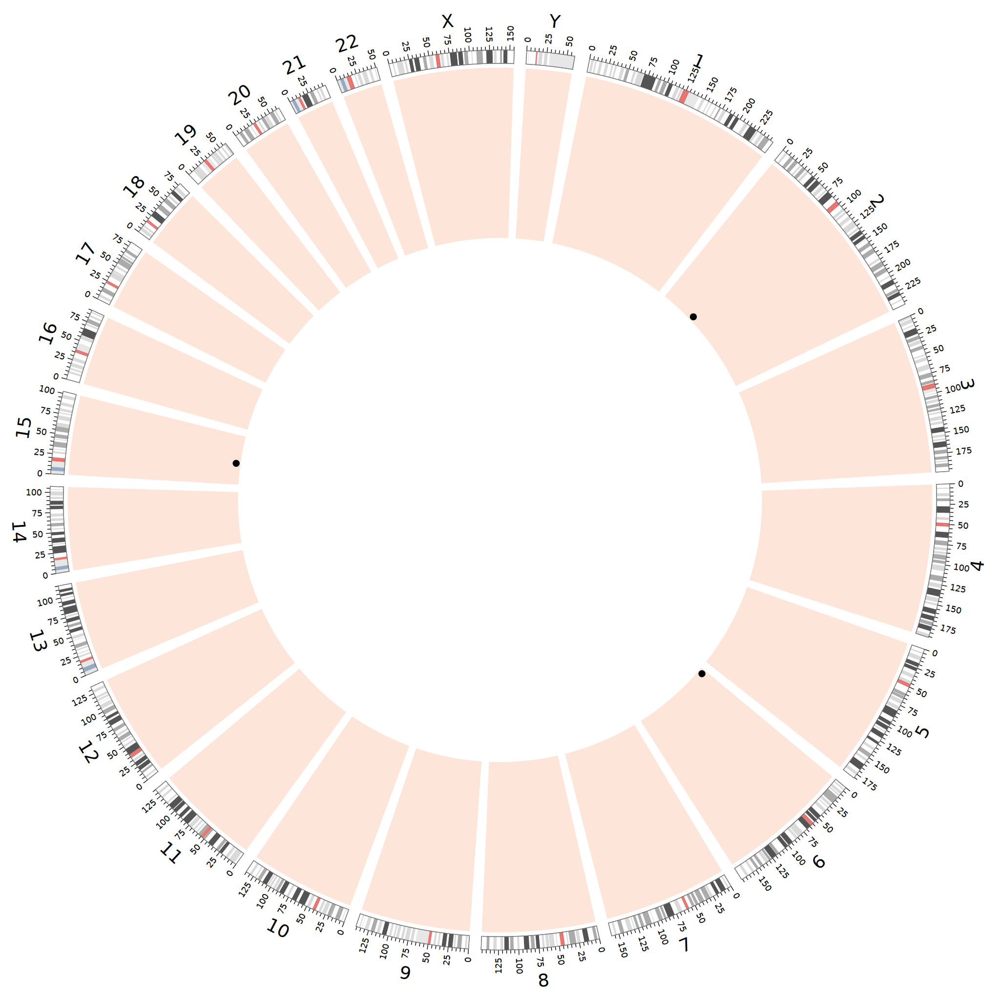
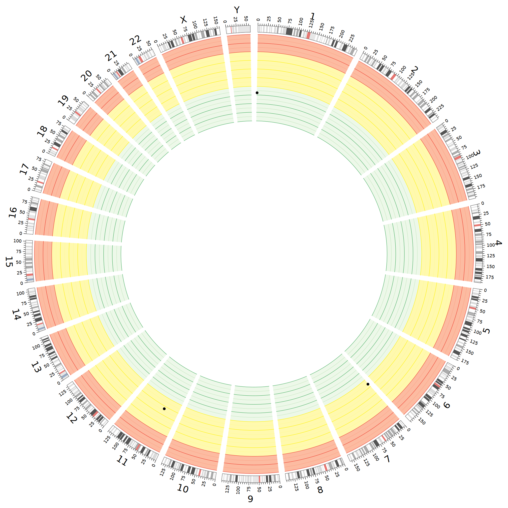

# iGWOS
**i**ntegrated **G**enome-**W**ide **O**ff-target cleavage **S**earch platform

## Introduction
iGWOS is designed specifically for an integrative analysis of the high-throughput sequencing data generated from various mainstream CRISPR/SpCas9 off-target detection techniques, as well as for the optimal off-target sites (OTS) prediction by integrating the available OTS prediction tools in a complementary way.   
* Current NGS data processing supports three OTS detection techniques (GUIDE-seq, CIRCLE-seq, and SITE-seq) in human species.  
* Current integrative method iGWOS, by integrating OTS prediction tools with an Adaboost framework, supports conventional NGG-PAM OTS prediction with mismatches up to 5, both for in vitro CIRCLE-seq, and cell-based experimental OTS detection in human species.

# Integrative NGS data processing for CRISPR OTS detection techniques
iGWOS It integrates the CIRCLE-seq analytic software (version 0.1.0) on GitHub at [https://github.com/tsailabSJ/circleseq](https://github.com/tsailabSJ/circleseq), as well as the GUIDE-seq analysis pipeline (version 0.9.0) on GitHub at [https://github.com/aryeelab/guideseq](https://github.com/aryeelab/guideseq), which were both developed by Shengdar Q Tsai, Martin Aryee, and Ved V Topkar.

By inputting sequencing data generated from a certain technique, iGWOS returns the detected off-target sites on the reference genome and visualizes the genome-wide off-target profile with a Circos plot.
## Requirement

* BWA==0.7.17-1
* bowtie2==2.3.4.1-1
* bedtools==2.26.0+dfsg-5
* samtools==1.7-1
* bcftools==1.7-2
> python3
* argparse==1.4.0
* svgwrite==1.1.6  
> python2
* HTSeq==0.6.1p1   
* PyYAML==3.11  
* swalign==0.3.1  
* pyfaidx==0.2.7     
* regex==2018.01.10   
* nwalign==0.3.1   
* numpy==1.11.1  
* statsmodels==0.6.1  
* pysam==0.9.1.4 
* paramiko==2.7.1
* svgwrite==1.1.6 

## Usage
    python3 Plt_main.py [-h] [-D [description]] [-O [output]] [-L [label]]
                   [-r1 [read1]] [-r2 [read2]] [-R [target]] [-F [reference]]
                   {GUIDE-seq,CIRCLE-seq,SITE-seq} ...

    Integrative NGS data processing for CRISPR OTS detection techniques
    
    optional arguments:
      -h, --help            show this help message and exit
      -O [output]           output folder
      -L [label]            name of the sgRNA which you use in the experiment
      -r1 [read1]           treated sequencing data 1, it should be noticed that
                            different methods require different types of input
                            data
      -r2 [read2]           treated sequencing data 2, if sequencing data is
                            single-end, only read1 is necessary
      -R [target]           target sequence including PAM
      -F [reference]        reference genome file, make sure the genome index
                            files under the same path when you choose SITE-seq
    
    subcommands:
      {GUIDE-seq,CIRCLE-seq,SITE-seq}
                            the experimental method of the data
        GUIDE-seq           genome-wide unbiased identification of DSBs enabled by
                            sequencing
        CIRCLE-seq          circularization for in vitro reporting of cleavage
                            effects by sequencing
        SITE-seq            selective enrichment and identification of tagged
                            genomic DNA ends by sequencing. It should be noticed
                            that the data provided by the paper has some problems
                            and the data is not in accord with the mechanism of
                            SITE-seq. So we can not test the correction of this
                            part
  
>when chosing GUIDE-seq   

    optional arguments:
      -h, --help            show this help message and exit
      -bar1 [barcode1]      barcode 1, necessary in GUIDE-seq
      -bar2 [barcode2]      barcode 2, necessary in GUIDE-seq
      -cbar1 [cbarcode1]    control barcode 1, necessary in GUIDE-seq
      -cbar2 [cbarcode2]    control barcode 2, necessary in GUIDE-seq
      -ind1 [index1]        index 1, necessary in GUIDE-seq
      -ind2 [index2]        index 2, necessary in GUIDE-seq
      --d-minreads [demultiplex_min_reads]
                            demultiplex_min_reads, necessary in GUIDE-seq with
                            default value 1000
			
>when chosing CIRCLE-seq   

    optional arguments:
      -h, --help            show this help message and exit
      -cr1 [cread1]         control sequencing data 1
      -cr2 [cread2]         control sequencing data 2
      -rt [read_threshold]  minimum number of reads at a location for that
                            location to be called as a site, necessary in CIRCLE-
                            seq with default value 4
      -ws [window_size]     size of the sliding window, necessary in CIRCLE-seq
                            with default value 3
      -mqt [mapq_threshold]
                            minimum read mapping quality score, necessary in
                            CIRCLE-seq with default value 50
      -st [start_threshold]
                            tolerance for breakpoint location, necessary in
                            CIRCLE-seq with default value 1
      -gt [gap_threshold]   number of tolerated gaps in the fuzzy target search
                            step, necessary in CIRCLE-seq with default value 3
      -mt [mismatch_threshold]
                            number of tolerated gaps in the fuzzy target search
                            step, necessary in CIRCLE-seq with default value 6
      -ma [merged_analysis]
                            whether or not the paired read merging step should be
                            performed, necessary in CIRCLE-seq with default value
                            True
                            
>when chosing SITE-seq  

    optional arguments:
      -h, --help  show this help message and exit

					
## Example  

    python3 Plt_main.py -O guide_test/ -L EMX1 -r1 debug_data/guide-seq/undemux.r1.fastq.gz -r2 debug_data/guide-seq/undemux.r2.fastq.gz -R GAGTCCGAGCAGAAGAAGAANGG -F debug_data/guide-seq/test_genome.fa GUIDE-seq -bar1 TAGGCATG -bar2 TAGATCGC -cbar1 CTCTCTAC -cbar2 CTCTCTAT -ind1 debug_data/guide-seq/undemux.i1.fastq.gz -ind2 debug_data/guide-seq/undemux.i2.fastq.gz

> output format

    Location	Reads	Strand	Cleavage_seq	Mismatch	Tagret_seq
    chr15:44108746-44110769	189	+	GAGTCTAAGCAGAAGAAGAAGAG	3	GAGTCCGAGCAGAAGAAGAANGG
    chr2:73159981-73162004	489	+	GAGTCCGAGCAGAAGAAGAAGGG	0	GAGTCCGAGCAGAAGAAGAANGG
    chr6:9117792-9119815	4	-	ACGTCTGAGCAGAAGAAGAATGG	3	GAGTCCGAGCAGAAGAAGAANGG

> cleavage site alignment visulization

> cleavage site Circos visualization

 

# Integrative prediction tools for precise genome-wide CRISPR OTS prediction
Predict CRISPR/Cas9-induced off-target cleavage sites by integrating distinct OTS prediction tools (CRISPRoff, DeepCRISPR, CFD, MIT, CROP-IT and CCTop).
The genome encode way can be referred to DeepCRISPR (https://github.com/bm2-lab/DeepCRISPR)

By inputting the gRNA(s) sequence file and related restrictions, iGWOS precisely predicts the genome-wide OTS list of given gRNAs with specificity scores, and visualizes the genome-wide off-target profile with a Circos plot. The iGWOS_score of a off-target site denotes its cleavage probability.

## Requirement
* python==3.7   
* pandas==0.20.1  
* numpy==1.14.5   
* pyfaidx==0.4.8.4    
* tensorflow==1.8.0  
* Sonnet==1.33
* CRISPRoff==1.1.1
* python==2.7
* biopython==1.73
* ViennaRNA==2.4.12
* RIsearch==2.1
* circos==0.69-6

## Usage
    python3 main.py [-h] [-v] [-gRNA GRNA] [-g GENOME] [-m {0,1,2,3,4,5}]
                    [-gpu GPU] [-o OUTPUT] {VITRO,CELL} ...

    Integrative prediction tools for precise genome-wide CRISPR OTS prediction
    
    optional arguments:
      -h, --help        show this help message and exit
      -v, --version     show program's version number and exit
      -gRNA GRNA        gRNAs file in Fasta format
      -g GENOME         genome folder for candidate off-target searching,
                        default=genome/hg19
      -m {0,1,2,3,4,5}  maximum mismatch allowed in off-target prediction,
                        default=5
      -gpu GPU          select a gpu device to perform cas-offinder and/or
                        deepcrispr, default=0
      -o OUTPUT         output folder, default=data/
      -circos {0,1}     whether to draw a circos plot to visualize the predicted
                        off-target profile, default=1

      
    subcommands:
      select the type of OTS detection technique

      {VITRO,CELL}
        VITRO           in-vitro CIRCLE-seq
        CELL            cell-based techniques
  
>when chosing VITRO

    optional arguments:
      -h, --help  show this help message and exit

>when chosing CELL

    optional arguments:
      -h, --help  show this help message and exit
      -cell CELL  cell-type of gRNAs
      -cid CID    cell-id file, formed like data/encode_hg19.tab
      -e ENCODE   epigenomic encode folder, default=/data/genome/encode/fa/
      
## Example  
    
    python3 main.py -gRNA data/grna.fa -g genome/hg19 -m 5 -gpu 1 -o output -circos 1 CELL -cell K562 -cid data/encode_hg19.tab -e /data/genome/encode/fa/

> gRNA file format     

    >sg1
    GCCTCCCCAAAGCCTGGCCAGGG
    >sg2
    GGCCAGGCTTTGGGGAGGCCTGG

> cell-id file format: [cid] [cell]
    
    h1	MCF-7
    h2	GM12878
    h3	HepG2
    h4	LNCaP clone FGC
    h5	HCT116
    h6	HeLa-S3
    h7	K562

> encode folder format (take K562 cell as an example)

    Format: [encode_path]/[cid]_[epi].fa
    
    /data/genome/encode/fa/h7_ctcf.fa
    /data/genome/encode/fa/h7_dnase.fa
    /data/genome/encode/fa/h7_h3k4me3.fa
    /data/genome/encode/fa/h7_rrbs.fa
    
> output format

    sgID	gRNA	OTS	Chr	Strand	Start	Mismatch	iGWOS_score
    sg1	GCCTCCCCAAAGCCTGGCCAGGG	GCCTCCCCAAAAGCTGAGCAGGG	chr1	+	929401	4	0.3254589692131059
    sg1	GCCTCCCCAAAGCCTGGCCAGGG	TGCTCCCCAGAGCCTAGCCGTGG	chr7	-	1900836	5	0.46115958387343875
    sg1	GCCTCCCCAAAGCCTGGCCAGGG	ACCTCCCCATAGCCTGGCCAGGG	chr11	-	44986455	2	0.529510001952807
 
> OTS Circos visualization format

  
    
## Citation

Jifang Yan, Qi Liu et al. Benchmark genome-wide CRISPR off-target detection and prediction. 2019 (Manuscript submitted)

## Contacts

[88jfyan@tongji.edu.cn](88jfyan@tongji.edu.cn) or [qiliu@tongji.edu.cn](qiliu@tongji.edu.cn)
