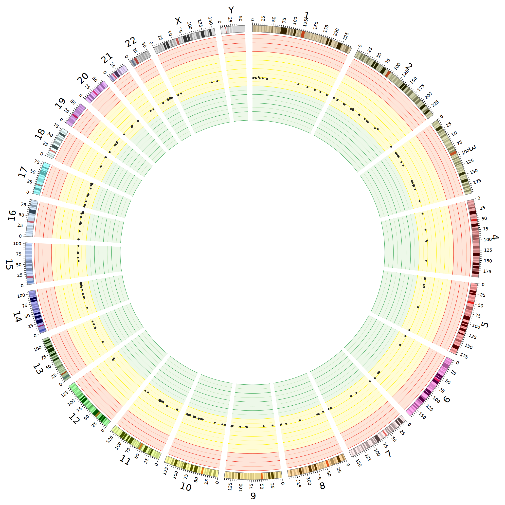

# iGWOS
**i**ntegrated **G**enome-**W**ide **O**ff-target cleavage **S**earch platform

## Introduction
iGWOS is designed for the optimal genome-wide off-target sites (OTS) prediction by integrating the available OTS prediction tools in a complementary way. iGWOS integrates OTS prediction tools with an Adaboost framework, supports conventional NGG-PAM OTS prediction with mismatches up to 6 in human species.

iGWOS searches the candidate off-target sites with Cas-OFFinder and predict CRISPR/Cas9-induced off-target cleavage sites by integrating distinct OTS prediction tools (CRISPRoff, uCRISPR, DeepCRISPR, CFD, MIT, CROP-IT and CCTop).
The genome encode way can be referred to DeepCRISPR (https://github.com/bm2-lab/DeepCRISPR)

By inputting the gRNA(s) sequence file and related restrictions, iGWOS precisely predicts the genome-wide OTS list of given gRNAs, and visualizes the top 200 risky genome-wide off-target profile with a Circos plot. The iGWOS score of a off-target site denotes its cleavage probability.

## Requirement
* python==3.7   
* pandas==0.20.1  
* numpy==1.14.5   
* pyfaidx==0.4.8.4    
* tensorflow==1.8.0  
* sonnet==1.33
* uCRISPR==0.1
* RNAstructure==6.2
* python==2.7
* biopython==1.73
* ViennaRNA==2.4.12
* RIsearch==2.1
* circos==0.69-6

## Installation
Install all the required software and packages mentioned above. Or you may refer to file "**Dockerfile**" to build the performing environment for iGWOS with the code: 
    
    # build image based on Dockerfile
    docker build -t igwos:latest ./

    # run container
    docker run --name [container_name] -d igwos:latest

Attention: the **Dockerfile** was built based on **Ubuntu** base image (Docker==18.09.6).

## Usage
    python3 main.py [-h] [-v] [-gRNA GRNA] [-g GENOME] [-m {0,1,2,3,4,5,6}]
             [-cell CELL] [-cid CID] [-e ENCODE] [-circos {0,1}] [-gpu GPU]
             [-o OUTPUT]

    Predict genome-wide CRISPR-Cas9 off-target sites with iGWOS.

    optional arguments:
    -h, --help        show this help message and exit
    -v, --version     show program's version number and exit
    -gRNA GRNA        gRNAs file in Fasta format
    -g GENOME         genome folder for candidate off-target searching,
                        default=genome/hg19
    -m {0,1,2,3,4,5,6}  maximum mismatch allowed in off-target prediction,
                        default=5
    -cell CELL        cell-type of gRNAs
    -cid CID          cell-id file, formed like data/encode_hg19.tab
    -e ENCODE         epigenomic encode folder, default=/data/genome/encode/fa/
    -circos {0,1}     whether to draw a circos plot to visualize the top 200
                      risky predicted off-target profile, default=1
    -gpu GPU          select a gpu device to perform cas-offinder and/or
                        deepcrispr, default=0
    -o OUTPUT         output folder, default=output/
      
## Example  
    
    python3 main.py -gRNA data/grna.fa -g genome/hg19 -m 5 -cell K562 -cid data/encode_hg19.tab -e /data/genome/encode/fa/ -circos 1 -gpu 1 -o output

> gRNA file format     

    >sg1
    GCCTCCCCAAAGCCTGGCCAGGG
    >sg2
    GGCCAGGCTTTGGGGAGGCCTGG

> cell-id file format: [cid] [cell]
    
    h1	MCF-7
    h2	GM12878
    h3	HepG2
    h4	LNCaP clone FGC
    h5	HCT116
    h6	HeLa-S3
    h7	K562

> encode folder format (take K562 cell as an example)

    Format: [encode_path]/[cid]_[epi].fa
    
    /data/genome/encode/fa/h7_ctcf.fa
    /data/genome/encode/fa/h7_dnase.fa
    /data/genome/encode/fa/h7_h3k4me3.fa
    /data/genome/encode/fa/h7_rrbs.fa
    
> output format

    sgID	gRNA	OTS	Chr	Strand	Start	Mismatch	iGWOS
    sg1	GCCTCCCCAAAGCCTGGCCAGGG	GCCTCCCCAAAAGCTGAGCAGGG	chr1	+	929401	4	0.3254589692131059
    sg1	GCCTCCCCAAAGCCTGGCCAGGG	TGCTCCCCAGAGCCTAGCCGTGG	chr7	-	1900836	5	0.46115958387343875
    sg1	GCCTCCCCAAAGCCTGGCCAGGG	ACCTCCCCATAGCCTGGCCAGGG	chr11	-	44986455	2	0.529510001952807
 
> OTS Circos visualization format 

  
    
## Citation

Jifang Yan, Qi Liu et al. Benchmarking and integrating genome-wide CRISPR off-target detection and prediction. 2019 (Manuscript submitted)

## Contacts

[88jfyan@tongji.edu.cn](88jfyan@tongji.edu.cn) or [qiliu@tongji.edu.cn](qiliu@tongji.edu.cn)
